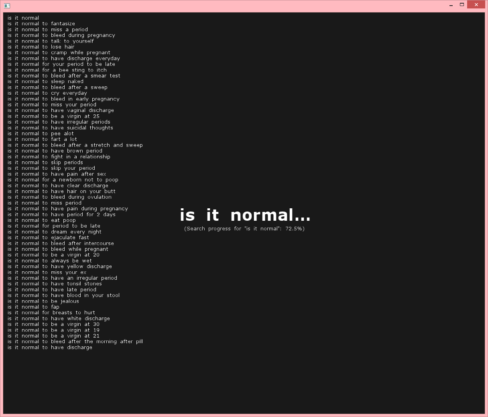

GoogleSeachSuggestions
======================

[openframeworks](http://openframeworks.cc/) app (built in [ofSketch](https://github.com/olab-io/ofSketch)) from a [project](http://www.mikewesthad.com/project_google.html) involving mining Google search suggestions.

This visualizer will asynchronously query 50 top level domain names (.com, .uk, etc.) for the search suggestions for a given phrase (e.g. "is it normal").

Instructions:
- Type to modify the search term.
- Press enter to begin looking for search suggestions
- Press F1 to save the search suggestions for the current search term to a plaintext file within `./bin/data`.

